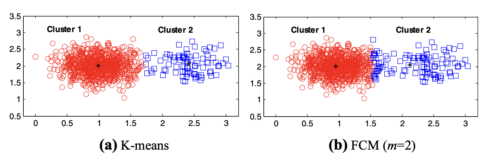

# CMEANS VS KMEANS

## DEFINITIONS:
### WHAT IS CLUSTERING:
Cluster analysis or clustering is the task of grouping a set of objects in such a way that objects in the same group are more similar to each other than to those in other groups.   

### WHAT IS KMEANS:
k-means clustering is a method of vector quantization, originally from signal processing, that aims to partition n observations into k clusters in which each observation belongs to the cluster with the nearest mean, serving as a prototype of the cluster.

### WHAT IS FUZZY CMEANS:
Fuzzy clustering is a form of clustering in which each data point can belong to more than one cluster. Clustering or cluster analysis involves assigning data points to clusters such that items in the same cluster are as similar as possible, while items belonging to different clusters are as dissimilar as possible.  

 

### WHAT IS THE DIFFERENCE BETWEEN CMEANS AND KMEANS:
C-means is fuzzy but k-means is hard (is not fuzzy), each point is belonging to a centroid in K-means, but in fuzzy c-means each point can be belonging to two centroids but with different quality. each point either is a part of the first centroids, or the second centroids.  
 

### Effect of cluster size distribution on clustering: a comparative study of k‐means and fuzzy c‐means clustering
This paper shows that fcm has stronger uniform effect than kmeans.  
It also shows that fuzzifer value m=2 that was widely adopted in many applications is not a good choice.  
for data sets with significant uneven distributions in cluster sizes, a smaller fuzzifier value is preferred for FCM clustering, and k-means clustering is a better choice compared with FCM clustering.

 
 